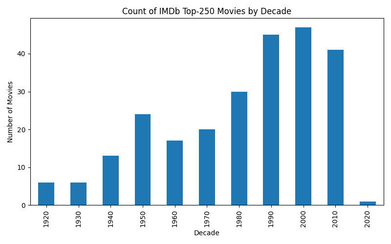
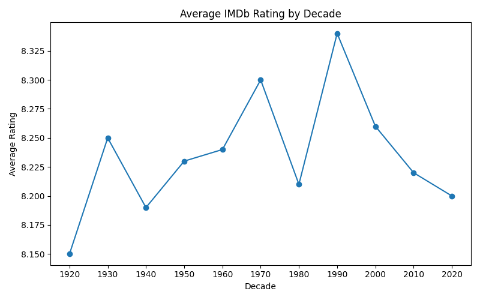
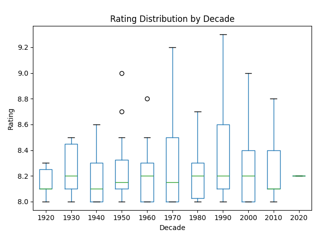

# IMDb Top-250 Movies by Decade



## Overview

This project analyzes the IMDb Top-250 movies and tracks trends by decade. You'll learn how to:

* Load and inspect the Top-250 dataset
* Extract the release year and group into decades
* Compute metrics:

  * Number of Top-250 movies released per decade
  * Average IMDb rating by decade
  * Rating distribution across decades
* Visualize findings with bar charts, line plots, and boxplots

## Prerequisites

* Python 3.7+
* `pip` package manager
* VS Code (or any code editor)

## Setup

1. **Clone the repository**

   ```bash
   git clone https://github.com/your-username/imdb-decade-analysis.git
   cd imdb-decade-analysis
   ```
2. **Create & activate virtual environment**

   ```bash
   python -m venv .venv
   source .venv/bin/activate  # macOS/Linux
   # .\.venv\Scripts\Activate  # Windows PowerShell
   ```
3. **Install dependencies**

   ```bash
   pip install pandas matplotlib jupyter
   ```
4. **Download the dataset**

   * **Option A (Kaggle API):**

     ```bash
     kaggle datasets download -d allubie/imdb-top-250-movies -p data --unzip
     ```
   * **Option B (Manual):**

     1. Visit [https://www.kaggle.com/datasets/allubie/imdb-top-250-movies](https://www.kaggle.com/datasets/allubie/imdb-top-250-movies)
     2. Click **Download** and unzip into a folder named `data/`

## Running the Notebook

1. Open Jupyter Notebook:

   ```bash
   jupyter notebook imdb_by_decade.ipynb
   ```
2. Run cells in order:

   1. **Import libraries & styling**
   2. **Load CSV & inspect columns**
   3. **Extract `year` and compute `decade`**
   4. **Group & compute metrics**
   5. **Plot charts**
3. The following image files will be generated in your project root:

   * `movies_per_decade.png`
   * `avg_rating_by_decade.png`
   * `rating_distribution_by_decade.png`

## Results and Visuals

### 1. Number of Top-250 Movies by Decade


* **Insight:** This bar chart shows which decades contributed the most films to IMDb’s Top-250.

### 2. Average IMDb Rating by Decade



* **Insight:** The line plot reveals how average ratings have shifted over time.

### 3. Rating Distribution by Decade



* **Insight:** Boxplots highlight the spread and outliers of ratings in each decade.

## License

MIT © Shubham Naik
